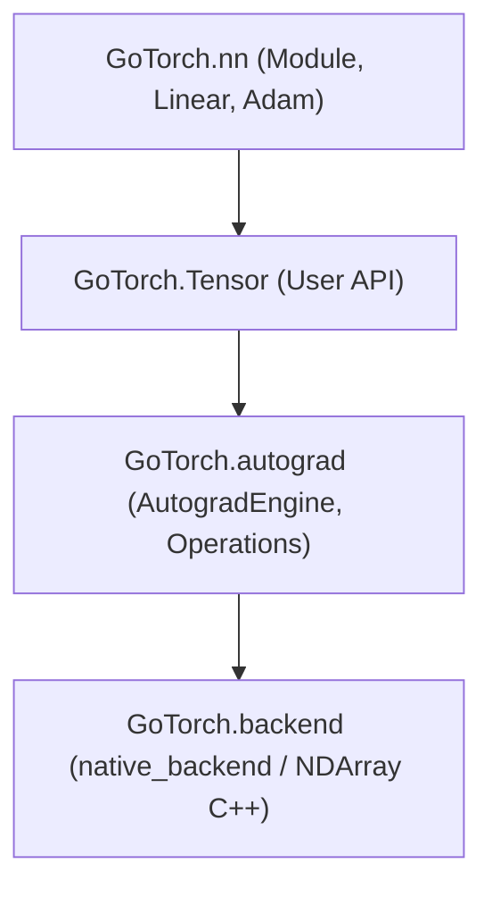

# 🚀 GoTorch

**GoTorch** is a lightweight, high-performance deep learning framework built from scratch in C++17 and Python. It features a custom C++ strided multi-dimensional array engine (`NDArray`), pybind11 bindings, a reverse-mode automatic differentiation DAG engine (`AutogradEngine`), an object-oriented neural network module library (`GoTorch.nn`), and an Adam optimizer verified for numerical parity against PyTorch.

---

## ✨ Features

- **⚡ High-Performance C++ Backend (`native_backend`)**:
  - Memory-efficient `NDArray` with zero-copy strided views and transpositions.
  - Multi-dimensional NumPy-style broadcasting support.
  - Fast vectorized element-wise addition (`+`), subtraction (`-`), and matrix multiplication (`@`).
  - Seamless Python interoperability via PyBind11.
- **🔄 Dynamic Reverse-Mode Autograd Engine**:
  - Directed Acyclic Graph (DAG) construction during the forward pass.
  - Post-order depth-first topological sorting for clean reverse execution.
  - Multi-path gradient accumulation (diamond graphs, shared parameters).
  - Adjoint operators for `Add`, `Sub`, `MatMul`, and `Transpose`.
- **🧠 Modular Neural Network API (`GoTorch.nn`)**:
  - `Module`: Base container for layers and submodules with recursive parameter registration (`parameters()`).
  - `Linear`: Fully-connected projection layer ($y = xW + b$) with configurable weight initialization and bias.
  - `Optimizer` & `Adam`: Full Adam optimizer implementation with first/second-moment tracking and bias correction.
- **🧪 Rigorous Verification & PyTorch Parity**:
  - Unit-tested against PyTorch ground truth for both forward outputs and backward gradients.
  - 100% passing test suite across both C++ (GoogleTest) and Python (pytest).

---

## 🏗️ Architecture



---

## 🛠️ Quick Start & Usage

### 1. Minimal Autograd Example

```python
from GoTorch.backend.native_backend import NDArray
from GoTorch.tensor import Tensor

# Create leaf tensors
a = Tensor(NDArray([1.0, 2.0, 3.0, 4.0], shape=(2, 2)))
b = Tensor(NDArray([2.0, 0.0, 1.0, 2.0], shape=(2, 2)))

# Build computational graph: out = (a @ b)
out = a @ b

# Backpropagate gradients
out.backward()

print("dL/da:\n", a.grad.data)
print("dL/db:\n", b.grad.data)
```

### 2. Training a Linear Layer with Adam

```python
from GoTorch.backend.native_backend import NDArray
from GoTorch.nn import Adam, Linear
from GoTorch.tensor import Tensor

# Define layer: 2 inputs -> 1 output
layer = Linear(input_dimension=2, output_dimension=1, bias=True)

# Instantiate Adam optimizer
optimizer = Adam(layer, lr=0.01, b1=0.9, b2=0.999)

# Training step
x = Tensor(NDArray([1.5, -2.0], shape=(1, 2)))

optimizer.zero_grad()
output = layer(x)
output.backward()
optimizer.step()
```

---

## 🧪 Testing & Build Instructions

### Prerequisites
- Linux OS with `g++` (C++17 or later) and `make`
- Python 3.10+ with `pytest` and `torch` (for verification)

### Build the C++ Extension
```bash
make build
```

### Run C++ Tests (GoogleTest)
```bash
make test-cpp
```

### Run Python Test Suite (pytest)
```bash
PYTHONPATH=. pytest -v tests/
```

---

## 🗺️ Roadmap & Future Vision

GoTorch is evolving into a full-scale deep learning engine! Here is what's on the horizon:

- **⚡ GPU Concurrency & Parallel Programming**:
  - 🧵 **CUDA Kernels**: Native CUDA kernels for vector addition, reductions, and fast GEMM matrix multiplication.
  - 🌊 **Asynchronous Stream Management**: Overlapping host-to-device (H2D) data transfers with kernel execution via CUDA streams.
  - 🏎️ **cuBLAS & cuDNN Integration**: Hardware-accelerated tensor operations on NVIDIA Tensor Cores.
  - 🔀 **Multi-threaded Work Dispatch**: Concurrent CPU/GPU queue scheduling and multi-threaded kernel submission.
- **🧩 Neural Network Expansions**:
  - Activation layers (`ReLU`, `GELU`, `Sigmoid`, `Tanh`).
  - Loss functions (`MSELoss`, `CrossEntropyLoss`).
  - Convolutional layers (`Conv2d`, `MaxPool2d`).
- **📦 Data Pipelines**:
  - Batch dataset loaders, streaming readers, and multithreaded data prefetching.
